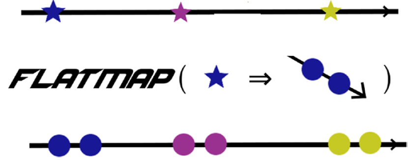
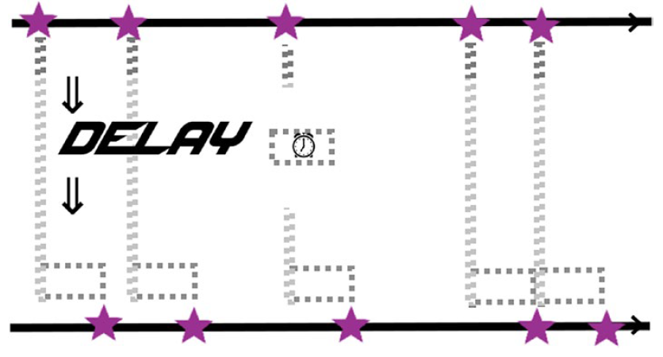
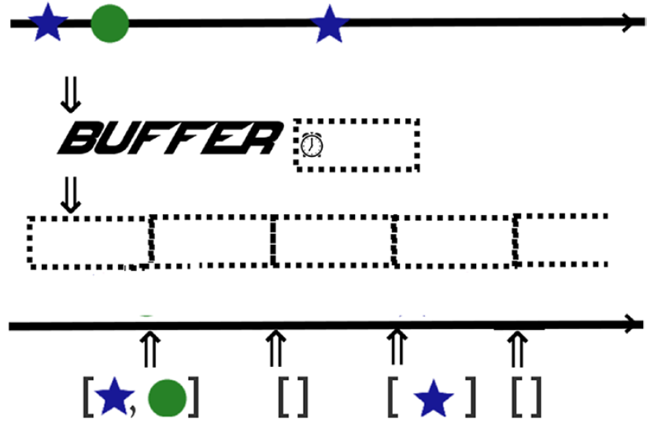
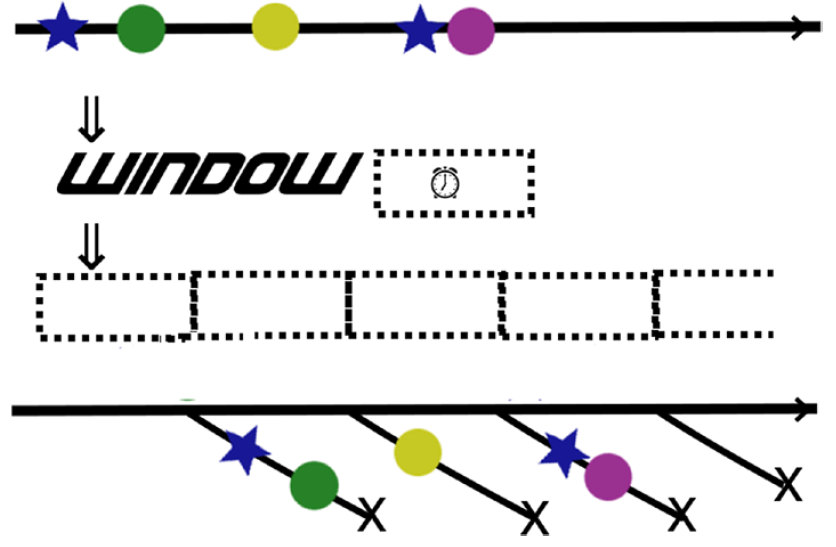
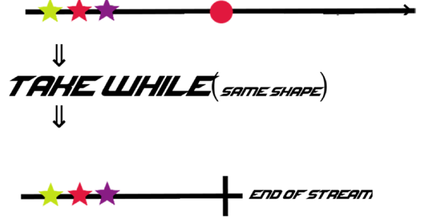

# Operators

## Filter

Filter will take only those elements that match a given predicate.

 

## Any/All

Any returns a Boolean value which is true if any elements in the stream match the given predicate.

All returns true if all the elements match.

These two only make sense for terminating (non-infinite) streams.

 

## Map

Map converts data  from one form into another. 

This is useful for any basic operations on data elements.

 

## FlatMap / ConcatMap

FlatMap maps data from one form into a stream of other forms and then
weaves the resulting streams together. 

This is useful when you want to convert one data stream into a new stream based on the results of
substreams. 

For example, you might want to convert a stream of sports teams into a stream of all the players of those teams.

ConcatMap is very similar, but preserves the ordering of the incoming streams, 
whereas flatMap eagerly subscribes to each new stream and merges the results in the order in which they arrive.

 

## Delay

This method delays data for a fixed amount of time.

 

## Buffer

Buffer keeps data over some time period and sticks it in a list, then observes each list.

Buffer is also a back-pressure strategy that caches all elements from a stream
if too many elements were produced than the subscriber could
handle. In this case the buffer is kept in memory and does not affect the
data type of the stream. If buffer is used, you have the option of dropping or
ignoring any elements above the bufferfs maximum size.

 

## Window

Window is much like buffer but results in Observables instead of lists.

 

## Take While

Take while (takeWhile) takes all elements while some condition is true,
then ends the stream when it is false. There is usually also a take(n) method
which takes a certain number of elements before ending the stream.

 

## Latest

“Latest” is a backpressure strategy that takes only the last element from
a stream if too many elements were produced than the subscriber could
handle.

 

## Debounce

Debounce is useful for noisy streams, for example, a text input or other
user inputs, when you only want elements after the stream was quiet for
some period of time. It gives you only the last element if the stream is silent
for a given duration.

 

## Throttle first

Throttle first (throttleFirst in RxJava) drops any elements from the stream
(after the first element emitted) for some given duration. Throttle last is
very similar only emitting the last element emitted during the time period
instead of the first. Reactor has similar methods, sample and sampleFirst.
Akka Streams has a similar method named throttle.

 
