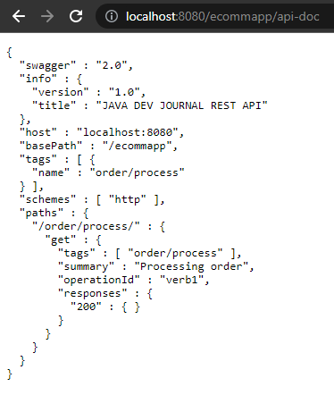
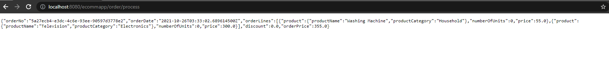
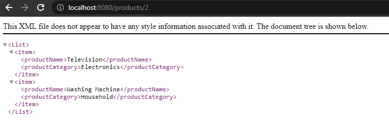

## Read API Specification based on Swagger

To check APIs that managed by camel-swagger-java-starter dependency, we should go ahead the link: [http://localhost:8080/ecommapp/api-doc](http://localhost:8080/ecommapp/api-doc).

Then, we have:

Next, we will go to [http://localhost:8080/ecommapp/order/process](http://localhost:8080/ecommapp/order/process).

- Fetch order-process:
  
   

 

## Some APIs that managed by Spring Web

1. Fetch products by id

    

   
