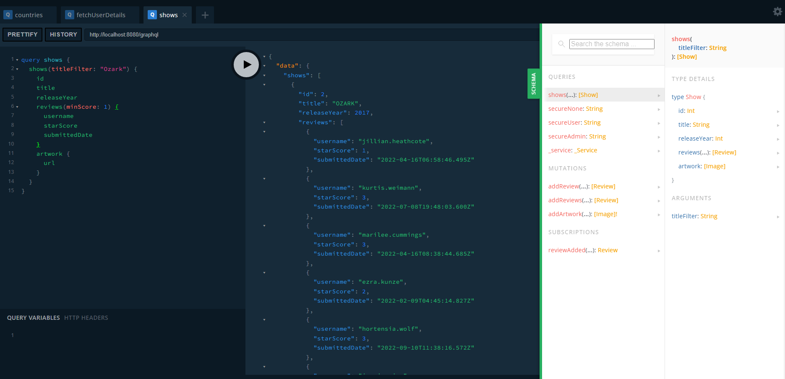

## Run application

1. Go to the postman or GraphQL extension on Chrome - `GraphQL Playground for Chrome`.

2. Type the following url - `http://localhost:8080/graphql`.

3. Check the schema that published from the current application.

4. Create query or mutation to work on it.

5. Result

    
    

<br>

## Wrapping up

- Using DataLoader to prevent N + 1 problem when loading data with one-to-many relationship.

- Using `@DgsData` annotation to fetch data for nested field.

    For example:
    - Load `reviews` from `shows` data.

- Using `graphqlcodegen-maven-plugin` plugin in `pom.xml` file to automatically generate classes from these types of GraphQL.

    ```xml
    <plugin>
        <groupId>io.github.deweyjose</groupId>
        <artifactId>graphqlcodegen-maven-plugin</artifactId>
        <version>1.24</version>
        <executions>
            <execution>
                <goals>
                    <goal>generate</goal>
                </goals>
            </execution>
        </executions>
        <configuration>
            <addGeneratedAnnotation>true</addGeneratedAnnotation>
            <schemaPaths>
                <param>src/main/resources/schema/schema.graphqls</param>
            </schemaPaths>
            <packageName>com.manhpd.showreviewdgs.generated</packageName>
        </configuration>
    </plugin>
   ```
    

<br>

References:

[https://github.com/Netflix/dgs-examples-java](https://github.com/Netflix/dgs-examples-java)
